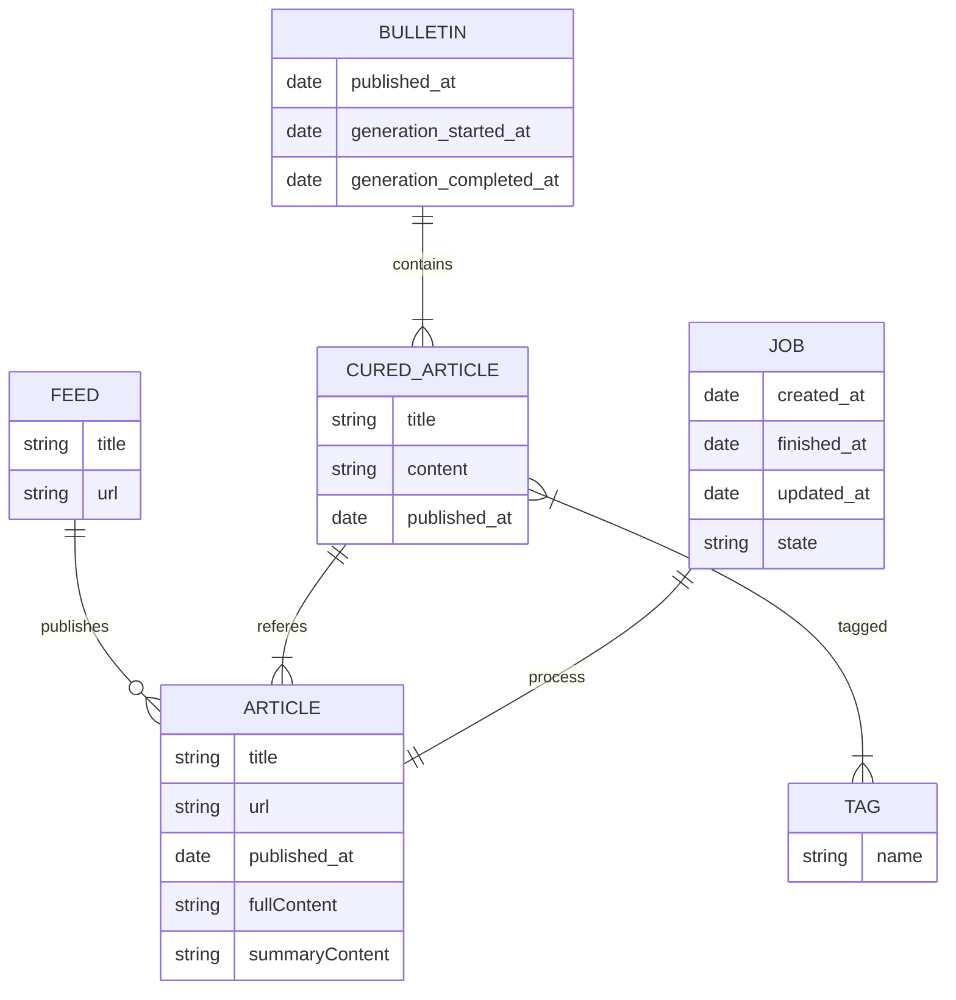

```mermaid
erDiagram
  FEED ||--o{ ARTICLE : publishes
  CURED_ARTICLE ||--|{ ARTICLE : referes
  CURED_ARTICLE }|--|{ TAG : tagged
  BULLETIN ||--|{ CURED_ARTICLE : contains
  JOB ||--|| ARTICLE : process


  FEED {
    string title
    string url
  }

  ARTICLE {
    string title
    string url
    date published_at
    string fullContent
    string summaryContent
  }

  CURED_ARTICLE {
    string title
    string content
    date published_at
  }

  TAG {
    string name
  }

  BULLETIN {
    date published_at
    date generation_started_at
    date generation_completed_at
  }

  JOB {
    date created_at
    date finished_at
    date updated_at
    string state
  }
```